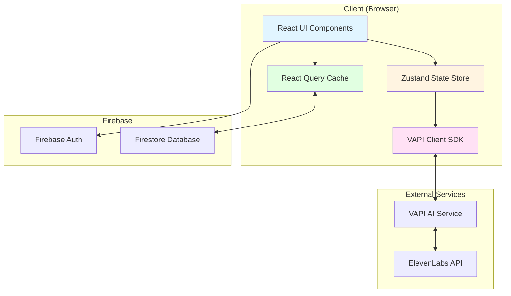

# Design Document: AI Interview Bot

## Overview

The AI Interview Bot is a Next.js application that provides voice-powered interview practice sessions. The system integrates VAPI AI for real-time voice conversations, ElevenLabs for text-to-speech synthesis, and Firebase for authentication and data persistence. The architecture follows a client-side React pattern with server actions for Firebase operations, using React Query for data fetching, Zustand for state management, and shadcn/ui components for the interface.

The design emphasizes real-time interaction, graceful error handling, and comprehensive data persistence to ensure users can practice interviews effectively and track their progress over time.

## Architecture

### High-Level Architecture



### Component Architecture

The application follows a layered architecture:

1. **Presentation Layer**: React components using shadcn/ui and Tailwind CSS
2. **State Management Layer**: Zustand stores for session state, UI state, and user preferences
3. **Data Access Layer**: React Query hooks for Firebase operations with caching
4. **Integration Layer**: VAPI client wrapper for voice conversation management
5. **Persistence Layer**: Firebase Firestore for data storage and Firebase Auth for authentication

### Data Flow

1. User authenticates via Firebase Auth
2. User configures interview session (type, difficulty)
3. VAPI client establishes voice connection
4. Real-time voice conversation occurs with transcription
5. Session data persists to Firestore incrementally
6. On completion, AI generates feedback and scores
7. User can review sessions and view analytics

## Components and Interfaces

### 1. Authentication Module

**Purpose**: Handle user authentication and profile management using Firebase Auth.

**Components**:
- `AuthProvider`: React context provider for authentication state
- `useAuth`: Custom hook for accessing authentication state
- `signIn(email, password)`: Authenticate user with email/password
- `signUp(email, password, displayName)`: Create new user account
- `signOut()`: Log out current user
- `getCurrentUser()`: Get currently authenticated user

**Firebase Integration**:
```typescript
interface User {
  uid: string;
  email: string;
  displayName: string;
  createdAt: Timestamp;
}
```

### 2. Interview Session Manager

**Purpose**: Manage the lifecycle of interview sessions including configuration, execution, and completion.

**State Interface**:
```typescript
interface InterviewSessionState {
  sessionId: string | null;
  status: 'idle' | 'configuring' | 'connecting' | 'active' | 'paused' | 'completed' | 'error';
  config: SessionConfig | null;
  transcript: TranscriptEntry[];
  startTime: number | null;
  endTime: number | null;
  error: string | null;
}

interface SessionConfig {
  type: 'behavioral' | 'technical' | 'system_design';
  difficulty: 'easy' | 'medium' | 'hard';
  userId: string;
}

interface TranscriptEntry {
  id: string;
  timestamp: number;
  speaker: 'interviewer' | 'user';
  text: string;
  confidence?: number;
}
```

**Operations**:
- `createSession(config: SessionConfig): Promise<string>`: Create new session in Firestore
- `startSession(sessionId: string): Promise<void>`: Initialize VAPI connection
- `pauseSession(): void`: Pause active session
- `resumeSession(): void`: Resume paused session
- `endSession(): Promise<void>`: Terminate session and trigger feedback generation
- `addTranscriptEntry(entry: TranscriptEntry): void`: Append to transcript and persist

**Zustand Store**:
```typescript
interface InterviewStore {
  session: InterviewSessionState;
  createSession: (config: SessionConfig) => Promise<string>;
  startSession: (sessionId: string) => Promise<void>;
  pauseSession: () => void;
  resumeSession: () => void;
  endSession: () => Promise<void>;
  addTranscriptEntry: (entry: TranscriptEntry) => void;
  setError: (error: string) => void;
  reset: () => void;
}
```

### 3. VAPI Client Wrapper

**Purpose**: Encapsulate VAPI AI SDK for voice conversation management with error handling and reconnection logic.

**Interface**:
```typescript
interface VAPIClientWrapper {
  connect(config: VAPIConfig): Promise<void>;
  disconnect(): Promise<void>;
  pause(): void;
  resume(): void;
  isConnected(): boolean;
  onTranscript(callback: (entry: TranscriptEntry) => void): void;
  onError(callback: (error: Error) => void): void;
  onStatusChange(callback: (status: VAPIStatus) => void): void;
}

interface VAPIConfig {
  sessionId: string;
  interviewType: string;
  difficulty: string;
  apiKey: string;
}

type VAPIStatus = 'connecting' | 'connected' | 'disconnected' | 'error';
```

**Implementation Details**:
- Wraps VAPI SDK client initialization
- Manages WebSocket connection lifecycle
- Handles automatic reconnection with exponential backoff
- Emits events for transcript updates, status changes, and errors
- Integrates with ElevenLabs for voice synthesis configuration

**Error Handling**:
- Connection failures: Retry up to 3 times with exponential backoff
- Network interruptions: Queue transcript updates and sync when reconnected
- API errors: Log error and notify user with actionable message

### 4. ElevenLabs Integration

**Purpose**: Configure and manage text-to-speech synthesis for AI interviewer voice.

**Interface**:
```typescript
interface ElevenLabsConfig {
  apiKey: string;
  voiceId: string;
  modelId: string;
  stability: number;
  similarityBoost: number;
}

interface TTSService {
  configure(config: ElevenLabsConfig): void;
  synthesize(text: string): Promise<AudioBuffer>;
  getVoiceSettings(): ElevenLabsConfig;
}
```

**Implementation**:
- VAPI AI handles ElevenLabs integration internally
- Configuration passed during VAPI client initialization
- Voice settings: Professional, clear, moderate pace
- Fallback: Display text if synthesis fails

### 5. Feedback Engine

**Purpose**: Analyze interview transcripts and generate scores and feedback using AI.

**Interface**:
```typescript
interface FeedbackEngine {
  generateFeedback(session: InterviewSession): Promise<FeedbackResult>;
}

interface FeedbackResult {
  overallScore: number; // 0-100
  categoryScores: CategoryScores;
  strengths: string[];
  improvements: string[];
  detailedFeedback: string;
  highlights: FeedbackHighlight[];
}

interface CategoryScores {
  communication: number;
  technicalAccuracy: number;
  problemSolving: number;
  clarity: number;
}

interface FeedbackHighlight {
  timestamp: number;
  transcriptId: string;
  type: 'strength' | 'improvement';
  comment: string;
}
```

**Implementation**:
- Uses OpenAI GPT-4 or similar LLM for analysis
- Analyzes transcript considering interview type and difficulty
- Generates structured feedback with specific examples
- Calculates scores based on rubric for each interview type
- Identifies key moments in the conversation

**Scoring Rubric**:
- **Behavioral**: STAR method usage, clarity, relevance, depth
- **Technical**: Correctness, explanation quality, edge case consideration, complexity analysis
- **System Design**: Architecture clarity, scalability discussion, trade-off analysis, component design

### 6. Firebase Data Access Layer

**Purpose**: Provide type-safe access to Firestore with React Query integration.

**Collections Structure**:
```typescript
// Collection: users/{userId}
interface UserDocument {
  uid: string;
  email: string;
  displayName: string;
  createdAt: Timestamp;
  totalSessions: number;
  totalPracticeTime: number; // milliseconds
}

// Collection: sessions/{sessionId}
interface SessionDocument {
  id: string;
  userId: string;
  type: 'behavioral' | 'technical' | 'system_design';
  difficulty: 'easy' | 'medium' | 'hard';
  status: 'active' | 'completed' | 'abandoned';
  startTime: Timestamp;
  endTime: Timestamp | null;
  transcript: TranscriptEntry[];
  feedback: FeedbackResult | null;
  duration: number; // milliseconds
  createdAt: Timestamp;
  updatedAt: Timestamp;
}
```

**React Query Hooks**:
```typescript
// Fetch user profile
function useUserProfile(userId: string) {
  return useQuery({
    queryKey: ['user', userId],
    queryFn: () => getUserProfile(userId),
  });
}

// Fetch user sessions
function useUserSessions(userId: string, filters?: SessionFilters) {
  return useQuery({
    queryKey: ['sessions', userId, filters],
    queryFn: () => getUserSessions(userId, filters),
  });
}

// Fetch single session
function useSession(sessionId: string) {
  return useQuery({
    queryKey: ['session', sessionId],
    queryFn: () => getSession(sessionId),
  });
}

// Create session mutation
function useCreateSession() {
  return useMutation({
    mutationFn: (config: SessionConfig) => createSession(config),
    onSuccess: (sessionId) => {
      queryClient.invalidateQueries({ queryKey: ['sessions'] });
    },
  });
}

// Update session mutation
function useUpdateSession() {
  return useMutation({
    mutationFn: ({ sessionId, updates }: { sessionId: string; updates: Partial<SessionDocument> }) =>
      updateSession(sessionId, updates),
    onSuccess: (_, { sessionId }) => {
      queryClient.invalidateQueries({ queryKey: ['session', sessionId] });
    },
  });
}
```

**Firestore Operations**:
- `getUserProfile(userId)`: Fetch user document
- `createUserProfile(user)`: Create new user document
- `getUserSessions(userId, filters)`: Query sessions with filters
- `getSession(sessionId)`: Fetch single session
- `createSession(config)`: Create new session document
- `updateSession(sessionId, updates)`: Update session document
- `addTranscriptEntry(sessionId, entry)`: Append transcript entry
- `completeSession(sessionId, feedback)`: Mark session complete with feedback

### 7. Analytics Calculator

**Purpose**: Calculate and aggregate user performance metrics from session history.

**Interface**:
```typescript
interface AnalyticsCalculator {
  calculateUserAnalytics(sessions: SessionDocument[]): UserAnalytics;
}

interface UserAnalytics {
  totalSessions: number;
  totalPracticeTime: number; // milliseconds
  averageScore: number;
  scoresByType: Record<InterviewType, number>;
  scoresByDifficulty: Record<DifficultyLevel, number>;
  scoreTrend: ScoreTrendPoint[];
  strongestCategory: string;
  weakestCategory: string;
  categoryAverages: CategoryScores;
}

interface ScoreTrendPoint {
  date: string; // ISO date
  score: number;
  sessionCount: number;
}
```

**Implementation**:
- Aggregates data from completed sessions
- Calculates averages, trends, and breakdowns
- Identifies patterns and insights
- Handles edge cases (insufficient data, outliers)

### 8. UI Components

**Purpose**: Provide reusable, accessible UI components for the interview experience.

**Key Components**:

**InterviewConfigurationForm**:
```typescript
interface InterviewConfigurationFormProps {
  onSubmit: (config: SessionConfig) => void;
  isLoading: boolean;
}
```
- Allows user to select interview type and difficulty
- Uses React Hook Form with Zod validation
- Displays shadcn/ui Select components

**InterviewSessionView**:
```typescript
interface InterviewSessionViewProps {
  sessionId: string;
  onEnd: () => void;
}
```
- Main interview interface during active session
- Displays AI interviewer avatar and current question
- Shows real-time transcript
- Provides session controls (pause, resume, end)
- Displays microphone activity indicator

**TranscriptDisplay**:
```typescript
interface TranscriptDisplayProps {
  entries: TranscriptEntry[];
  autoScroll?: boolean;
}
```
- Renders conversation transcript
- Distinguishes interviewer vs user messages
- Shows timestamps
- Auto-scrolls to latest entry

**SessionControls**:
```typescript
interface SessionControlsProps {
  status: SessionStatus;
  onPause: () => void;
  onResume: () => void;
  onEnd: () => void;
  elapsedTime: number;
}
```
- Displays pause, resume, end buttons
- Shows elapsed time
- Disables invalid actions based on status

**FeedbackView**:
```typescript
interface FeedbackViewProps {
  feedback: FeedbackResult;
  session: SessionDocument;
}
```
- Displays overall score with visual indicator
- Shows category scores with bar charts
- Lists strengths and improvements
- Displays detailed feedback text
- Highlights key moments with transcript references

**SessionHistoryList**:
```typescript
interface SessionHistoryListProps {
  sessions: SessionDocument[];
  onSelectSession: (sessionId: string) => void;
  filters?: SessionFilters;
  onFilterChange?: (filters: SessionFilters) => void;
}
```
- Lists past sessions in reverse chronological order
- Shows session metadata (date, type, difficulty, score)
- Provides filtering by type and difficulty
- Supports date range search

**AnalyticsDashboard**:
```typescript
interface AnalyticsDashboardProps {
  analytics: UserAnalytics;
}
```
- Displays key metrics (total sessions, average score, practice time)
- Shows score trend line chart using recharts
- Displays performance breakdown by type and difficulty
- Highlights strongest and weakest categories
- Shows insufficient data message when needed

## Data Models

### Firestore Schema

**users collection**:
```typescript
{
  uid: string;
  email: string;
  displayName: string;
  createdAt: Timestamp;
  totalSessions: number;
  totalPracticeTime: number;
}
```

**sessions collection**:
```typescript
{
  id: string;
  userId: string;
  type: 'behavioral' | 'technical' | 'system_design';
  difficulty: 'easy' | 'medium' | 'hard';
  status: 'active' | 'completed' | 'abandoned';
  startTime: Timestamp;
  endTime: Timestamp | null;
  transcript: Array<{
    id: string;
    timestamp: number;
    speaker: 'interviewer' | 'user';
    text: string;
    confidence?: number;
  }>;
  feedback: {
    overallScore: number;
    categoryScores: {
      communication: number;
      technicalAccuracy: number;
      problemSolving: number;
      clarity: number;
    };
    strengths: string[];
    improvements: string[];
    detailedFeedback: string;
    highlights: Array<{
      timestamp: number;
      transcriptId: string;
      type: 'strength' | 'improvement';
      comment: string;
    }>;
  } | null;
  duration: number;
  createdAt: Timestamp;
  updatedAt: Timestamp;
}
```

### Zustand State Models

**Interview Session Store**:
```typescript
interface InterviewStore {
  session: {
    sessionId: string | null;
    status: SessionStatus;
    config: SessionConfig | null;
    transcript: TranscriptEntry[];
    startTime: number | null;
    endTime: number | null;
    error: string | null;
  };
  vapiClient: VAPIClientWrapper | null;
  // ... actions
}
```

**UI State Store**:
```typescript
interface UIStore {
  isSidebarOpen: boolean;
  activeView: 'configuration' | 'session' | 'feedback' | 'history' | 'analytics';
  isLoading: boolean;
  toast: ToastMessage | null;
  // ... actions
}
```

### Form Validation Schemas

**Session Configuration Schema**:
```typescript
const sessionConfigSchema = z.object({
  type: z.enum(['behavioral', 'technical', 'system_design']),
  difficulty: z.enum(['easy', 'medium', 'hard']),
});
```

**User Registration Schema**:
```typescript
const userRegistrationSchema = z.object({
  email: z.string().email('Invalid email address'),
  password: z.string().min(8, 'Password must be at least 8 characters'),
  displayName: z.string().min(2, 'Name must be at least 2 characters'),
});
```

## Correctness Properties

*A property is a characteristic or behavior that should hold true across all valid executions of a system—essentially, a formal statement about what the system should do. Properties serve as the bridge between human-readable specifications and machine-verifiable correctness guarantees.*

Before writing the correctness properties, I need to analyze the acceptance criteria for testability.


### Core Properties

**Property 1: Authentication Required for Interview Access**
*For any* unauthenticated user attempting to access interview features, the system should reject the request and require authentication.
**Validates: Requirements 1.1**

**Property 2: Profile Creation on Authentication**
*For any* successful user authentication, a User_Profile document should exist in Firebase_Store with the user's identification and creation date.
**Validates: Requirements 1.2**

**Property 3: Session Cleanup on Logout**
*For any* authenticated user who logs out, the local authentication state should be cleared and any active session should be terminated.
**Validates: Requirements 1.3**

**Property 4: User Profile Structure Completeness**
*For any* User_Profile document in Firebase_Store, it should contain uid, email, displayName, createdAt, totalSessions, and totalPracticeTime fields.
**Validates: Requirements 1.4**

**Property 5: Session Creation with Valid Configuration**
*For any* valid SessionConfig (with type and difficulty selected), creating a session should result in a new Interview_Session document with matching configuration properties.
**Validates: Requirements 2.3**

**Property 6: Configuration Validation**
*For any* incomplete SessionConfig (missing type or difficulty), the system should reject session creation and display validation errors.
**Validates: Requirements 2.4**

**Property 7: Unique Session Identifiers**
*For any* two Interview_Session documents created at different times, they should have distinct session identifiers.
**Validates: Requirements 2.5**

**Property 8: VAPI Connection on Session Start**
*For any* Interview_Session that transitions to active status, a VAPI_Client connection attempt should be initiated.
**Validates: Requirements 3.1**

**Property 9: Connection Error Handling**
*For any* VAPI_Client connection failure, the system should display an error message and provide a retry option without crashing.
**Validates: Requirements 3.5, 12.1**

**Property 10: Graceful Disconnection**
*For any* active Interview_Session that is ended, the VAPI_Client should disconnect and release resources.
**Validates: Requirements 3.6**

**Property 11: Synthesis Fallback**
*For any* text-to-speech synthesis failure, the system should display the text content and continue the session without audio.
**Validates: Requirements 4.3, 12.2**

**Property 12: Question Generation on Session Start**
*For any* Interview_Session that begins, an opening question appropriate to the session's type and difficulty should be generated.
**Validates: Requirements 5.1**

**Property 13: Follow-up Question Generation**
*For any* user answer completion during an active session, a follow-up question or topic transition should be generated.
**Validates: Requirements 5.2**

**Property 14: Question Appropriateness for Interview Type**
*For any* Interview_Session, all generated questions should be appropriate for the session's Interview_Type (behavioral questions for behavioral interviews, technical questions for technical interviews, system design questions for system design interviews).
**Validates: Requirements 5.3, 5.4, 5.5**

**Property 15: Question Appropriateness for Difficulty Level**
*For any* Interview_Session, all generated questions should match the session's Difficulty_Level complexity (foundational for easy, analytical for medium, advanced for hard).
**Validates: Requirements 5.6, 5.7, 5.8**

**Property 16: Transcript Entry Structure**
*For any* TranscriptEntry in a Session_Transcript, it should contain id, timestamp, speaker (interviewer or user), and text fields.
**Validates: Requirements 6.3, 6.4**

**Property 17: Real-time Transcript Updates**
*For any* message (from interviewer or user) during an active session, a corresponding TranscriptEntry should be appended to the Session_Transcript within 2 seconds.
**Validates: Requirements 6.1, 6.2**

**Property 18: Low-Confidence Transcription Marking**
*For any* transcription with confidence below 0.7, the TranscriptEntry should be marked with the confidence score.
**Validates: Requirements 6.5**

**Property 19: Feedback Generation on Completion**
*For any* Interview_Session that transitions to completed status, the Feedback_Engine should generate a FeedbackResult.
**Validates: Requirements 7.1**

**Property 20: Score Bounds Validation**
*For any* FeedbackResult, the overallScore and all categoryScores should be between 0 and 100 inclusive.
**Validates: Requirements 7.2**

**Property 21: Feedback Structure Completeness**
*For any* FeedbackResult, it should contain overallScore, categoryScores (communication, technicalAccuracy, problemSolving, clarity), strengths array, improvements array, detailedFeedback text, and highlights array with transcript references.
**Validates: Requirements 7.3, 7.4, 7.5**

**Property 22: Session Persistence**
*For any* Interview_Session created or updated, the changes should be persisted to Firebase_Store within 5 seconds.
**Validates: Requirements 8.1, 8.2**

**Property 23: Completed Sess